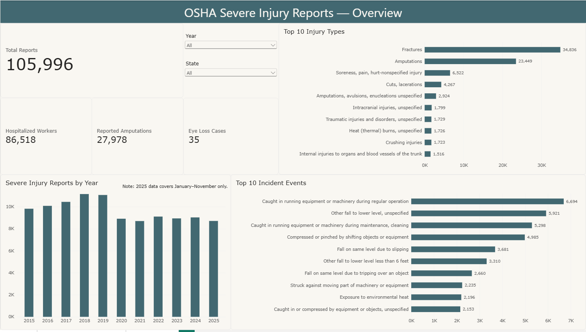
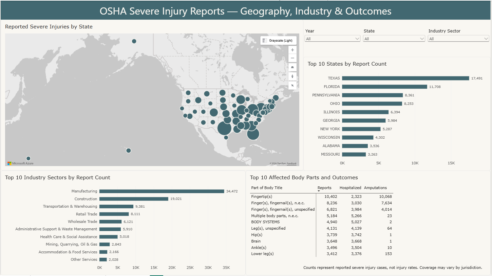
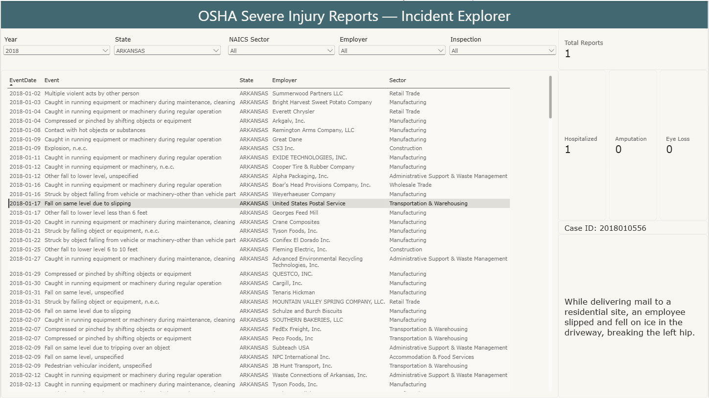

# OSHA Severe Injury Reports Analysis

I built this Power BI project using OSHA's public Severe Injury Reports dataset. My goal was to work with a large real-world dataset and create a report that moves from overall trends to individual incident details.

The dataset contains **105,996 reports** from **January 2015 to November 2025**.

## Report Pages

### 1. Safety Overview

This page gives a general view of the dataset:

- Total reports
- Hospitalizations, amputations, and eye-loss cases
- Reports by year
- Top injury types
- Top incident events
- Year and state filters

### 2. Geography, Industry & Outcomes

This page focuses on where the incidents were reported and which industries were involved:

- State-level map
- Top 10 states by report count
- Top 10 NAICS industry sectors
- Affected body parts and reported outcomes
- Year, state, and industry filters

### 3. Incident Explorer

This page is for looking at individual records. The table can be filtered by year, state, industry sector, employer, and inspection status.

Selecting a row shows the case ID, hospitalization, amputation, and eye-loss values, together with the incident narrative.

## What I Did

- Imported and cleaned the CSV data with Power Query
- Corrected data types and trimmed text fields
- Prepared year, location, and industry fields
- Created KPI and selection-based DAX measures
- Built an interactive map and report filters
- Added a record-level detail panel for incident narratives

## A Few Findings

- Manufacturing had the highest number of reports, followed by construction.
- Texas and Florida had the highest report counts in this dataset.
- Fractures and amputations were the most common injury categories.
- Machinery-related incidents and falls were among the leading incident events.

## Important Notes

These values are **reported case counts, not injury rates**. The dataset does not contain workforce size or hours-worked data, so it should not be used to rank the safety performance of states or industries.

The data only represents incidents under **federal OSHA jurisdiction**. It does not cover every OSHA-approved State Plan jurisdiction.

The 2025 data covers January through November only.

## Tools

- Power BI Desktop
- Power Query
- DAX
- Azure Maps

## Data Source

I used OSHA's official Severe Injury Reports dataset for this project. You can access and download the data here:

[OSHA Severe Injury Dashboard](https://www.osha.gov/severe-injury-reports)

## Files

- `OSHA_Severe_Injury_Analysis_2015_2025.pbix` — Power BI report
- `01-safety-overview.png` — overview page
- `02-geography-industry-outcomes.png` — geography and industry page
- `03-incident-explorer.png` — incident detail page

## Opening the Report

Download the `.pbix` file and open it with Power BI Desktop. To refresh the report, download the dataset from the link above and update the CSV source path in Power Query.
